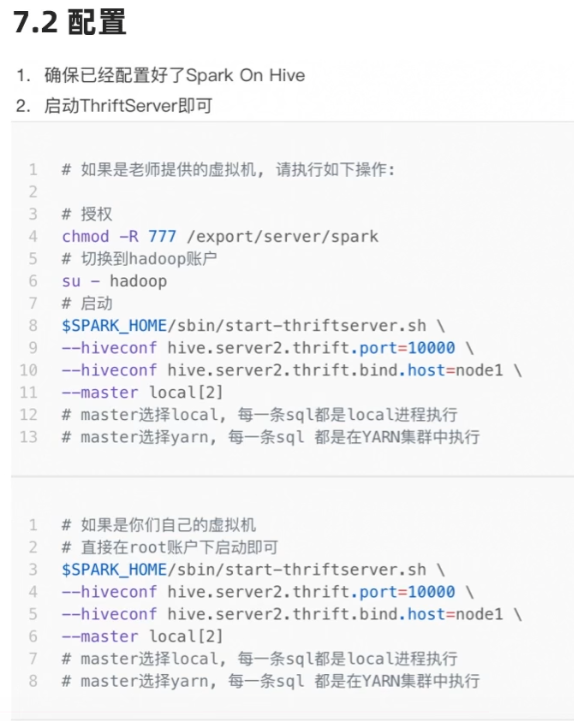
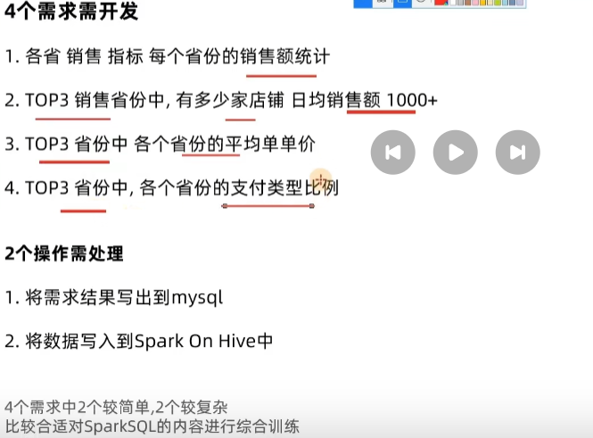

spark 是**大规模数据处理的统一分析引擎**。

spark计算过程：按分区处理


spark与hadoop的对比：


spark仅能做计算，并不能完全替代spark，hadoop生态圈不仅有计算，还有存储和资源管理功能

## 1.4 spark的四大特点

### （1）速度快

spark处理数据时，可以将中间结果存储到内存中，mapreduce计算基于内存完成交换

spark提供了非常丰富的算子，可以做到复杂任务在一个spark程序中完成

### （2）易于使用


### （3）通用性强

提供了spark Core API


saprk在离线处理，图像计算，流计算，sql处理，机器学习方面都有很好的应用

### （4）支持多种运行方式

## 1.5 spark框架模块

spark Core：spark的核心，是spark运行的基础，以RDD为数据抽象

spark sql：基于sparkcore之上，提供结构化数据的处理模块，structuredStreaming模块，可以以sparksql为基础，进行数据的流式计算

sparkStreaming:提供数据的流式计算功能

MLlib:进行机器学习计算

Graphx:提供了大量图计算API

## 1.6 spark运行模式


## 1.7 spark的架构角色

yarn任务计算层面

单任务管理者（master)：applicationMsater

单任务执行者(worker)：Task

spark运行角色：


master:集群资源的管理

worker:单机资源的管理

Driver:单个任务的管理

Executer:单个任务的计算，一个executor可以处理多个分区

# 二. spark on yarn 的安装部署

## 2.1spark on yarn 的本质

master角色由yarn的resourcemanager担任

worker角色由yarn的nodemanager担任

Driver角色运行在yarn容器的内部或提交任务的客户端进程

executor运行在yarn容器内

## 2.2部署模式deploymode

两种模式的区别就是Driver运行的位置

cluster模式：driver运行在yarn容器内部，和applicationMaster运行在一个容器内，

client模式：driver运行在客户端程序进程中


## 2.3 为什么把spark布置在yarn集群上

提高资源利用率，在已有yarn场景下让spark受到yarn调度可以更好的管控资源提高利用率并方便管理

#### 分布式代码执行的重要特征：

在spark中，非任务处理部分由Driver执行

执行部分由Executor执行（RDD）代码

#### 简述pyspark的架构体系：

python on spark driver端由JVM运行，executor端由JVM做命令转发，底层由python解释器进行工作


# 三.sparkCore

## 1.RDD解释

### 1.1为什么需要RDD

在分布式框架中，需要一个统一的数据抽象对象，来完成分区控制，shuffle控制，数据计算API，数据存储、发送

### 1.2什么是RDD

RDD叫做弹性（可扩容）分布式数据集，代表一个不可变、可分区、里面的元素可并行计算的集合

dataset:一个数据集合

distributed:RDD中的数据是分布式存储的，可用于分布式计算

resilient：RDD中的数据可以存储在内存中或者磁盘中

### 1.3RDD的五大特性

#### （1）RDD是有分区的

RDD的分区时RDD存储的最小单位

一个RDD数据，本质上是分割成了多个分区

#### （2）计算方法会作用到每一个分区

#### （3）RDD之间是有相互依赖关系的


#### （4）key-value型的RDD是有分区器的

KV型RDD内存出的数据是二元元组

默认分区器：hash分区规则，也可以手动设置一个分区器（rdd.partitionBY）

#### （5）RDD的分区规划，会尽量靠近数据所在地的服务器

这样可以走本地读取，避免网络读取

### 1.4wordcount案例分析


## 2.spark编程

### 2.1 程序执行入口sparkcontext对象

只有构建出sparkcontext，基于它才能执行后续的api调用和计算

### 2.2RDD的创建

并行化创建：本地集合转向分布式RDD

rdd=sparkcontext.parallelize(集合对象,分区数)

读取文件创建

### 2.3RDD算子

算子是什么：分布式集合对象上的API称为算子

本地对象上的API，叫做方法\函数

#### 算子分类：

**transformation算子**：rdd的算子，返回值仍然是算子（构建执行计划，并不运行）

**action算子**：返回值不是rdd的就是action算子（是一个指令让这个执行计划开始工作，没有action算子，transformation算子不工作）

### 2.4 常用transformation算子

**map 算子**：是将rdd数据一条条处理（处理的逻辑 基于map算子接受的函数）返回新的rdd


**flatMap算子**：对rdd进行map操作，再进行接触嵌套操作

**reduceByKey算子**

针对key-value型算子，自动按照key分组，然后按照你提供的聚合逻辑，完成组内数据聚合操作


**mapValues算子**

针对二元元组RDD，对其内部的二元元组的Value执行Map操作


**groupBy算子**

将rdd数据进行分组


**filter算子**：过滤想要的数据进行保留

返回时true的数据被保留，false的数据丢弃

**distinct算子**：对RDD数据去重

**union算子**：将两个rdd合并成一个rdd返回，只合并，不去重

**join**算子：对两个rdd执行join操作（可实行SQL的内外链接）

只能用于二元元组

**intersection算子**：求两个rdd交集

**glom算子**：将rdd的数据，加上嵌套，这个嵌套按照分区进行

**groupByKey算子**：针对kv型rdd，自动按照key分组

**sortBy算子**：对RDD数据进行排序，基于指定的排序依据

**sortByKey算子**：按照key进行排序


如果上传的代码依赖其他文件，可以用--py-files同步提交依赖文件


在本地代码中，应如下写法：

```python
#coding=utf8
from pyspark import SparkConf,SparkContext
import os
import json
os.environ['HADOOP_CONF_DIR']='/export/server/hadoop/etc/hadoop'
os.environ['YARN_CONF_DIR']='/export/server/hadoop/etc/hadoop'
os.environ['PYSPARK_PYTHON']='/root/anaconda3/bin/python3'
if __name__=="__main__":
    conf=SparkConf().setAppName("test-yarn").setMaster("yarn")
    #如果提交到集群运行，除了主代码以外，还依赖了其他文件。需要设置一个参数，同步上传到集群中
    #参数的值可以是.py文件，也可以是zip压缩包
    conf.set("spark.submit.pyFiles","defs.py")
    sc = SparkContext(conf=conf)
    rdd=sc.textFile('hdfs://node1:8020/order.text')
    #进行rdd数据的split按照|符号进行切分
    json_rdd=rdd.flatMap(lambda x:x.split('|'))
    #完成json到字典的转化
    dict_rdd=json_rdd.map(lambda x:json.loads(x))
    beijing_rdd=dict_rdd.filter(lambda d:d['areaName']=='北京')
    #组合北京rdd和商品类型形成新的字符串
    new_rdd=beijing_rdd.map(lambda d:(d['areaName'],d['category'])).distinct().groupByKey().map(lambda x:(x[0],list(x[1])))
    print(new_rdd.collect())
```

### 2.5常用Action算子

**countByKey算子**:统计key出现的次数

**reduce算子：**对rdd数据集按照你传入的逻辑进行聚合

**fold算子**：接受传入逻辑进行聚合，聚合是带有初始值的


**first算子**：取出第一个元素

**take算子**：取前n个元素

**top算子**：对rdd结果集进行降序排序，取前n个

**count算子**：返回rdd多少数据

**takeSample算子**：随机抽样rdd的数据


**takeOrdered算子**：对rdd排序取前N个

```python
#coding=utf8
from pyspark import SparkConf,SparkContext
if __name__=="__main__":
    conf=SparkConf().setAppName("test").setMaster("local[*]")
    sc=SparkContext(conf=conf)
    rdd=sc.parallelize([1,2,3,5,7,4,2,4,8],1)
    print(rdd.takeOrdered(3,lambda x:-x))
```

**foreach算子**：对rdd每一个元素。执行你提供的逻辑的操作，但是没有返回值

结果是由executor直接输出的，不用汇总到driver

**saveAsTextFile算子**：将rdd数据写入文本中

不经过driver汇总，由各个executor写出，保证IO性能

### 2.6分区操作算子

**mapPartitions算子**：一次被传递的是一整个分区的数据，作为一个迭代器对象传入过来

**foreachPartitions算子：**对一整个分区数据处理

**partitionBy算子**：对RDD自定义分区

**repartition算子**：对分区进行重新分区（仅数量），最好不用要用，最好减少分区

groupBykey和reduceByKey算子的区别：

groupByKey仅有分组功能而已

reduceByKey还有reduce聚合功能

reduceByKey性能远大于groupByKey加聚合逻辑，最大的提升在与分组前进行了预聚合。

# 三、RDD的持久化

## 3.1 RDD的数据是过程数据

新RDD的生成，代表老RDD的消失，就从内存中清理，给后续的计算腾出空间

## 3.2 RDD的缓存

避免迭代的链条重新计算


建议rdd.persist(StorageLevel.DISK_ONLY)

#清理缓存

rdd.unpersist()

```python
from pyspark.StorageLevel import StorageLevel
```

缓存设计上认为是不安全的，一旦丢失，就要重新计算缓存了，缓存必须要**保留被缓存RDD前置血缘关系，是分散存储的**

### 3.3 RDD的CheckPoint

仅支持硬盘存储，不保留血缘关系，设计上认为是安全的

存储RDD数据，集中存储到硬盘或HDFS上

```python
 sc.setCheckpointDir("hdfs://node1:8020/data/ckp")#指定checkpoint存储的hdfs路径
 rdd3.checkpoint()
```

对比：checkpoint不管分区数量多少，风险是一样的，缓存分区越多，风险越高

checkpoint支持写入HDFS，缓存不行，HDFS是高可靠存储，且有副本

checkpoint不支持内存，缓存可以，性能比checkpoint要好一点

**checkpoint适合大体量，计算成本大的数据，缓存适用于轻量RDD的存储**

### 4.2提交到集群运行

**榨干集群性能提交**

先看集群资源有多少：
(1)：查看cpu有几核

```shell
cat /proc/cpuinfo|grep processor| wc -l
```

(2):查看内存有多大：

```shell
free -g
```

简单规划：吃掉6核CPU，吃掉12G内存

希望使用6个executor来干活

```shell
bin/spark-submit --master yarn --py-files /root/defs.py \
--executor-memory 2g \
--executor-cores 1 \
--num-executors 6 \
/root/main.py
```

## 5.1广播变量

一个executor启动一个进程，进程内资源共享。


为什么不将本地list创建为另一个rdd，再将两个rddjoin？


产生shuffle，增加网络IO次数，占用executor内存

## 5.2累加器

**综合案例**

```python
#coding=utf8
from pyspark import SparkConf,SparkContext
import re
if __name__=="__main__":
    conf=SparkConf().setAppName("test").setMaster("local[*]")
    sc=SparkContext(conf=conf)
    #读取文件
    file_rdd=sc.textFile('../data/accumulator_broadcast_data.txt')
    abnormal_char=[',','.','!','#','$','%']
    #特殊字符包装成广播变量
    broadcast = sc.broadcast(abnormal_char)
    #对特殊字符出现次数出现累加，累加使用累加器
    acmlt=sc.accumulator(0)
    #数据处理,先处理数据的空行，有内容就是True,None就是False
    line_rdd=file_rdd.filter(lambda line:line.strip())
    data_rdd=line_rdd.map(lambda line:line.strip())
    #对数据进行切分，按照正则表达式式切分，'\s'
    word_rdd=data_rdd.flatMap(lambda line:re.split("\s+",line))
    #当前rdd中有正常单词，也有特殊符号
    def filter_func(data):
        global acmlt
        #取出广播变量中特殊符号list
        abnormal_chars=broadcast.value
        if data in abnormal_chars:
            acmlt+=1
            return False
        else:
            return True
    #过滤特殊字符
    normal_word_rdd=word_rdd.filter(filter_func)
    result_rdd=normal_word_rdd.map(lambda x:(x,1)).reduceByKey(lambda a,b:a+b)
    print('正常单词技术结果：',result_rdd.collect())
    print('特殊单词数量：',acmlt)
```

# 六、Spark内核调度

## 6.1 DAG

**spark的任务调度**就是如何组织任务去处理RDD中每个分区的数据，根据RDD的依赖关系构建DAG，基于DAG划分阶段，将每个阶段的任务发到指定节点运行

用以描述任务执行流程，主要作用是协助DAG调度器构建Task分配用以做任务管理

 action算子是执行链条的开关

## 6.2DAG的宽窄依赖和阶段划分

窄依赖：父RDD的一个分区，全部将数据发给子RDD的一个分区


宽依赖：父RDD的一个分区，将数据发给子RDD的多个分区（典型的shuffle）


为了对DAG进行阶段的划分：从后向前，遇到宽依赖就划分一个阶段，称之为stage


阶段一有三个独立的“内存计算管道”，由3个线程并行工作，一个RDD的一个分区只会被一个task处理，一个task会处理多个RDD的同一个分区

## 6.3内存迭代计算


基于带有分区的DAG以及阶段划分，可以从图中得到逻辑上最优的task分配，一个task是一个线程来具体执行，如上图，task1,task2,task3形成了三个并行的内存计算管道

spark默认收到全局并行度的限制，除了个别算子有特殊分区情况，大部分算子会遵循全局默认情况。

**面试题：spark是怎么做内存计算的？DAG的作用？为了内存计算，stage阶段划分的作用，为了构建内存计算管道**

1.Spark会产生DAG图

2.DAG图会基于分区和宽窄依赖划分阶段

3.一个阶段内部都是窄依赖，窄依赖内，如果形成1：1的分区对应关系，就可以产生许多内存迭代计算管道

4.这些内存迭代计算的管道，就是一个个具体的执行task

5.一个task是一个具体的线程，任务跑在一个线程内，就是纯内存计算了

**面试题：spark为什么比mapreduce快？**

1.spark算子丰富，mapreduce算子匮乏，mapreduce编程模型很难在一套MR中处理复杂的任务，很多复杂的任务，需要多个MR进行串联，多个MR串联通过磁盘交互数据

2.spark可以执行内存迭代，算子之间形成DAG基于依赖划分阶段后，在阶段内形成内存迭代管道，但是Mapreduce的map和reduce之间依旧是通过硬盘来交互的

## 6.4spark并行度

spark并行：在同一时间内，有多少个task在同时运行

**executor与并行度没有关系**


```shell
--conf "spark.default.parallelism=3"
```

```python
conf=SparkConf()
conf.set("spark.default.parallelism","3")
```

**集群中如何规划并行度**：**只看CPU核数**，设置为CPU总核心的2-10倍，比如集群可用CPU核心是100个，我们建议并行度为200-1000


## 6.5 Spark任务调度


**spark程序调度流程：**

1.driver构建出来

2.构建SparkContext（执行环境入口对象）

3.基于DAG scheduler（DAG调度器）构建逻辑Task分配

4.基于TaskScheduler（task调度器）将逻辑Task分配到各个executor上干活，并监控

5.executor被TaskScheduler管理监控，听从它们的指令干活，并定期汇报进度

**driver内两个组件**：

DAG调度器：将逻辑DAG图进行处理，最终得到逻辑上的Task划分

Task调度器：基于DAGScheduler的产出，来规划逻辑task，应该在哪些物理executor上运行，以及监控他们运行

## 6.6 Spark运行原理总结

1.一个spark环境可以运行多个application

2.一个代码运行起来，会成为一个application

3.aplication内部可以有多个job

4.每个job由一个action产生，并且每个job都有自己的DAG执行图

5.一个job的DAG图，会基于宽窄依赖划分成不同的阶段

6.不同阶段基于分区数量，形成多个并行的内存迭代管道

7.每一个内存迭代管道形成一个Task（DAG调度器将job内划分出具体的task任务，一个job被划分出来的task在逻辑上称之为job的taskset）

# SparkSQL

# 一、sparkSQL简介

## 1.3SparkSQL的特点

融合性：SQL可以无缝集成在代码中，随时用 SQL处理数据

统一数据访问：一套标准API可读写不同数据源

HIve兼容：可以使用SParkSQL直接计算并生成HIve数据表

标准化链接：支持标准化JDBC\ODBC连接，方便各种数据库进行数据交互  

## 二、SparkSQL概述

## 2.1SparkSQL和HIVE异同

都是分布式SQL计算引擎，都可以运行在YARN之上


SparkSQL拥有更好的性能

## 2.2SparkSQL的数据抽象

SParkSQL-DataFrame，底层数据存储结构是二维表

## 2.4DataFrame概述

抽象数据集，适合处理结构化数据

## 2.5SparkSession对象

用于SparkSql执行环境入口

```python
#coding=utf8
from pyspark.sql import SparkSession
if __name__=='__main__':
    spark=SparkSession.builder.appName('test').master('local[*]').getOrCreate()
    #通过SparkSession对象，获取SparkContext对象
    sc=spark.sparkContext
    df=spark.read.csv('../data/stu_score.txt',sep=',',header=False)
    df2=df.toDF('id','name','score')
    df2.printSchema()
    df2.show()

    df2.createTempView('score')
    spark.sql("""select * from score where name='语文' limit 5""").show()
    #DSL风格
    df2.where("name='语文'").limit(5).show()
```

# 三、DataFrame入门

## 3.1DataFrame组成

在结构层面：
StructType对象描述整个dataframe表结构

StructField对象描述一个列的信息

数据层面：

Row对象记录一行数据

Column对象记录一列数据并包含列的信息


## 3.2dataframe的创建

将pandas的dataframe对象，转变为分布式sparkSql的dataframe对象


通过SparkSQL统一API进行数据读取创建


## 3.3Dataframe的入门操作

dataframe支持两种风格编程，分别是DSL风格，SQL风格

DSL称之为领域特定语言，就是指dataframe特有的API，DSL风格意思是调用API的方式来处理data

## 3.8dataframe数据写出


### 3.9dataframe通过jdbc读写数据库


sparkSQ自动优化（catalyst优化器），分为两点

谓词下推

列值裁剪

## 5.4SparkSQL的执行流程

1.提交SparkSQL代码

2.catalyst优化

​	生成原始AST语法树

​	标记AST元数据

​	进行断言下推和列值裁剪，以及其他方面的优化作用

​	将最终的AST，生成执行计划

​	将执行计划翻译成RDD代码

3.由DAG调度器生成逻辑Task

4.由task调度器将逻辑task分配到exeutor上运行

5.task调度器监控executor的运行

## 7.2Sparkthriftserver配置



# Spark案例


